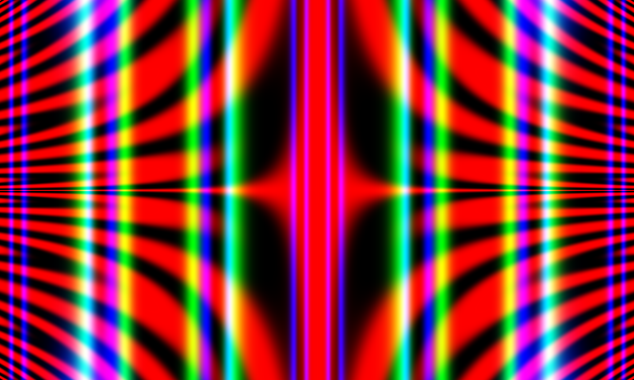
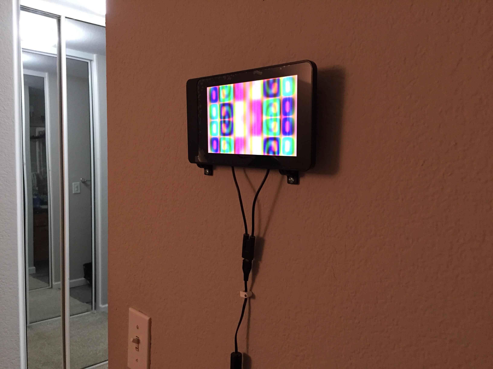

# ART_GENR8R

My Java-based translation/modification of this Python project: https://jeremykun.com/2012/01/01/random-psychedelic-art/

Here's an example image generated using my version:

Written in my free time using [Processing](https://processing.org/) to generate the images. I occasionally run it on my Raspberry Pi and screen at home when I feel like my room needs an aesthetic boost. It will generate a new image every 15 seconds.

Because the original project made use of lambda functions and Processing uses a version of Java that doesn't support them, I overcame this by giving each function component it's own class implementing a common Operation interface. Pretty clever, right? :)
